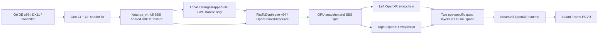

# FlatToDepth feasibility and implementation decision

*The first section keeps the original reasoning for Ori and the Blind Forest, the first game the program handled; it is still the worked example. Names below are the current ones.*

Assessed 6 October 2026. This is a prototype, with headset acceptance still required.

## Renderer and stereo generation

The [Ori fix author's page](https://helixmod.blogspot.com/2015/04/ori-and-blind-forest-dx11.html) documents a DX11 path and a Definitive Edition Geo-11 fix. The installed Steam `oriDE.exe` has PE machine `0x014c` (x86), verified directly. This makes an x64 injected DLL inappropriate; the external VR process can still be x64. Unity shader configuration is present in the downloaded fix. Actual loaded D3D modules and texture behavior remain a game-run check.

[Geo-11's announcement](https://helixmod.blogspot.com/2022/06/announcing-new-geo-11-3d-driver.html) describes a geometric stereo driver built using 3DMigoto's hooks and shader manipulation. It creates stereo rendering rather than estimating depth from a flat desktop image. Game-specific shader corrections are still necessary. The announcement is not a source-level description of its internal eye replay algorithm; that implementation is not verified here.

The Ori package contains shader replacements, `force_stereo=2`, convergence presets 12/16/24, and adjustable HUD depth. The author documents fixes for light/fog/water halos, vignette, and a scene-specific distortion. These corrections provide a useful starting point, not a guarantee that every scene is correct. Keep the Ori-specific `d3dx.ini` and `ShaderFixes` when upgrading the driver. The package embeds v0.6.15; the official general driver download currently advertises v0.7.11. Test the bundled fix first, then an upgrade as a separate experiment.

## Exact capture recommendation

Use **Geo-11 integration plus a standalone x64 OpenXR application**. Set `[Device] direct_mode = katanga_vr` in Geo-11's `d3dxdm.ini`. This is preferable to the initially suggested SBS Present capture because an existing GPU export already exists.

Inspected v0.7.11 `d3dxdm.ini` explicitly lists half SBS (`sbs`), top/bottom (`tab`), reversed variants, and `katanga_vr`. The [VRScreenCap documentation](https://github.com/artumino/VRScreenCap) identifies `katanga_vr` as full SBS. Its [public loader source](https://github.com/artumino/VRScreenCap/blob/main/src/loaders/katanga_loader.rs) opens `Local\KatangaMappedFile`, reads the exported handle, opens it with D3D11 `OpenSharedResource`, obtains texture dimensions/format, and treats it as full SBS. Thus there is no need to intercept private per-eye textures for the first prototype.

Read only the low 32-bit legacy KMT handle from the mapping for x86/x64 compatibility. Do not treat it as a pointer or close it with `CloseHandle`. Validate the actual texture description and reject unsupported layouts. Open the export on the OpenXR-required adapter, snapshot it once on the GPU, and copy its left/right rectangles into two OpenXR swapchains. No desktop capture or CPU pixel readback in normal operation. Use full SBS's per-eye width/height to derive screen aspect ratio. Provide eye-swap configuration until order is verified in a headset.

Implementation follow-up: the real x86 Ori export was successfully imported by x64 FlatToDepth. The user reported inverted depth with the left SBS half routed to the left eye, so this setup now uses `swap_eyes=1`. That routes the right SBS half to the left eye and the left half to the right eye. Calibration uses its own known eye order.



`FlatToDepth.exe` owns the loader, instance, D3D11 device, stereo session, spaces, swapchains, and frame loop. Ori keeps controller input and its own game camera. Start Ori separately through Steam for the first milestone; avoid launcher complexity. SteamVR compositor handles head tracking of a fixed quad placed 2.5 m away. Submit two [core quad layers](https://registry.khronos.org/OpenXR/specs/1.1/man/html/XrCompositionLayerQuad.html) with LEFT/RIGHT eye visibility and identical world poses, using a PRIMARY_STEREO session and locating normal stereo views for diagnostics. Projection-layer rendering can be added behind the same image-source interface if runtime behavior or future diorama geometry requires it. No need for a room scene or head-driven game camera.

## Risks and limits

- **Legacy synchronization:** the inspected mapping contains a handle, not a frame counter, fence, or documented keyed-mutex protocol. A GPU snapshot ensures both eye copies use the same local resource but does not prove the producer wasn't writing during that snapshot. `Flush` alone is not a cross-process lock. Diagnose tearing/staleness on real Geo-11; do not claim guaranteed atomic stereo frames. A synchronized exporter is the fallback if this is visible.
- **Restart/resize:** handles can change. Reopen the mapping periodically and rebuild eye swapchains when dimensions/format change. Handle reuse without generation metadata and silent producer stalls remain limits of the legacy protocol.
- **Adapter and color:** use the LUID and feature level returned by [OpenXR D3D11 requirements](https://registry.khronos.org/OpenXR/specs/1.1/man/html/XrGraphicsRequirementsD3D11KHR.html). Both processes must use the same GPU. Log actual DXGI format; use a compatible sRGB OpenXR format for display-encoded UNORM input. Reject formats needing shader conversion for now.
- **Comfort:** full SBS supplies binocular disparity, not a geometric view of scene layers from arbitrary head positions. The physical window follows normal VR perspective but Ori's imagery has no positional head parallax. Keep separation modest; validate convergence, window-edge violations, vertical alignment, and reversed eyes. Original 100% separation defaults may be excessive in VR.
- **Scheduling:** a busy foreground game can starve an external VR process; [Katanga's author notes this limitation](https://github.com/bo3b/katanga/blob/master/ProjectNotes.txt). Measure frame timing before changing process ownership. An in-process VR output would be a later performance tradeoff and needs x86 runtime validation.
- **Dependency distribution:** Geo-11 is supplied as a binary dependency; no supported private per-eye C++ API was found. Ori's downloaded package includes a personal-use license. Keep downloaded driver/fix packages outside version control and refer users to their authors rather than bundling them.

## Alternatives

A Present/DXGI hook is technically appropriate for final DX11 output, but a hook placed on the game's wrapper may see the pre-composite mono buffer. A fallback must capture **after** Geo-11's SBS composition, at the underlying real swapchain, export a synchronized GPU texture, and handle resize/device loss. That requires an x86 DLL for this game and coexistence with Geo-11's proxy. Desktop capture is not part of this design. Direct private per-eye interception would require a verified API or supported Geo-11 changes and is deferred.

## Repository and concrete MVP plan

```text
CMakeLists.txt             x64 native build; official OpenXR loader only
flattodepth.ini                the game menu's screen geometry (each game has flattodepth-<id>.ini)
src/common.hpp             logging, errors, stereo validation/test pattern
src/source.hpp             Katanga GPU source and diagnostic image
src/main.cpp               OpenXR lifecycle, adapter/device, eye swapchains, quads
tests/gpu_smoke.cpp         synthetic shared-texture export/import and eye split
scripts/                   dependency bootstrap, build, runtime launch
docs/assessment.md         this decision and sources
docs/testing.md            evidence and hardware acceptance procedure
.deps/                     ignored official binaries, downloaded references
```

1. Build a small logged x64 application. Enumerate extensions/runtime/system/view configurations/resolutions and optional refresh-rate extension. Fail with useful errors when no headset/runtime is available.
2. Create `XR_KHR_D3D11_enable` session on runtime LUID. Submit a deliberately different stereo calibration image to two eye-only quad layers. Verify fixed pose and tracking with the headset.
3. Validate GPU sharing and eye split independently using a synthetic Katanga exporter and readback only in the test.
4. Connect the real Katanga source, validate descriptors, snapshot/split on GPU, handle mapping/texture changes. Wait with zero submitted layers when no Ori feed exists; never silently substitute mono Ori.
5. Install the existing Ori-specific Geo-11 fix separately, set `katanga_vr`, launch through Steam, then launch FlatToDepth. Validate actual eye content, visual comfort, controller behavior, resize, cutscenes, and frame pacing on Steam Frame.
6. After hardware acceptance, add configuration/recenter polish and measure need for a synchronized exporter. Stereo separation/convergence/HUD remain Geo-11 controls; curvature and positional diorama rendering are deferred.

## Follow-up: a games catalog instead of two hard-coded games

Nothing in the bridge is specific to Ori: it imports whatever full-SBS picture a Geo-11-fixed game exports through `katanga_vr`, shows it, and publishes the controllers as an XInput pad. The two-game assumption lived only in a compiled table (`src/games.hpp`) and a hand-copied twin in `scripts/games.ps1`, which had to be kept in step by hand. Both are replaced by one data file read by both programs.

**One file, two readers.** `games.catalog.ini` (shipped) and `games.user.ini` (the user's, never overwritten, same-named sections replace the shipped ones) are plain INI. `src/catalog.hpp` and `scripts/games.ps1` parse them with the same rules, and `tests/catalog_cases.txt` is a single list of valid and invalid entries that both test programs run, so the menu and the installers cannot disagree. Writing that list found three real disagreements before any user could hit them (a leading `+` in an app number was accepted by C++ only, the archive name derived from a download address was checked by PowerShell only, and a Steam app number above 2^31 overflowed PowerShell's `[int]`).

**The entries are trusted input, so they are validated hard.** An entry names files and a download address that scripts will join into paths and fetch. Anything that ends up in a path must be a plain name (letters, digits and `_.-+`, no folder, no `..`); a `fix_url` must be `https://` and must come with the SHA256 of the file that was inspected, so a catalog change can never make the installer fetch something unpinned; shim names must be `xinput*.dll`; shortcut keys must be F1 to F12; an invalid entry is skipped whole and reported rather than half-loaded. The shipped catalog is reviewed like code, because pointing a hash at a different file changes what millions of installs would download.

**Steam scan.** Steam records every installed game in `steamapps\appmanifest_<id>.acf` in each library. The scan reads those (app number, name, install folder, state flags) once every ten seconds in the menu, instead of one file check per known game, so the menu can show "the supported games you have" however long the catalog gets. A record whose folder name would leave `steamapps\common`, or whose state says it is still downloading, is not offered.

**What the scan can and cannot say.** `FlatToDepth.exe --scan` reads each installed game's executable (bitness, and the import tables for the graphics API and the XInput DLL), and looks for DLL names as text, since engines such as Unity load Direct3D and XInput by name. DirectX 11 is necessary for Geo-11 but not sufficient: a stereo fix is made by hand for one game, and nothing on disk says whether one exists. So the scan only ever calls a game "supported" (it is in the catalog) or a "candidate" (worth looking for a fix), and the in-headset menu offers catalog games only. A candidate with no fix would show a wrong picture.

**The controller shim is the remaining Ori-shaped part.** The shim exists as a 32-bit `xinput9_1_0.dll` and a 64-bit `xinput1_4.dll` / `xinput1_3.dll`. A 32-bit game that loads `xinput1_3.dll` or `xinput1_4.dll` would need another 32-bit build, which has not been made or tested; the scan reports each game's XInput DLL so this is visible up front.

## Follow-up: curved screen, glow, floating window, rumble and the tools panel

These share one idea: the picture still comes from the same SBS export and the game is untouched, and everything new is either a different way to submit the same two eye images or a layer around them.

**Curved screen.** `XR_KHR_composition_layer_cylinder`, when the runtime lists it, replaces each eye's quad with a cylinder layer carrying the same sub-image, so no pixel is resampled by FlatToDepth. The screen is a section of a vertical cylinder tangent to the window plane at its centre, with radius = distance / curvature, so curvature 1 is concentric with the viewer when the screen was placed or last moved (the radius does not follow the head afterwards, or the shape would breathe with every lean). To keep the bar, handle and resizing working unchanged, hit-testing intersects the controller ray with the cylinder and returns *unrolled* coordinates (arc length and height), which are exactly the flat window's coordinates; controls are placed back on the surface with `onScreen`. The one uncertainty is the layer's pose: the specification calls it "the center point of the view of the cylinder", which can be read as a point on the visible surface (like a quad's pose) or as the cylinder's axis. The default is the surface; `curve_pose_at_axis=1` switches reading, and this has not been checked against SteamVR. The specification text could not be fetched while this was written.

**Floating window.** An object nearer than the screen is seen further right by the left eye than by the right. If the picture's edges are to appear in front of the screen, the left eye must start its picture a little further in at the left edge and the right eye must end its picture a little earlier at the right edge. Because each eye is its own layer, this is only a different sub-image rectangle and quad width per eye (`fx::eyeSlice`). It hides up to 2.5% of the picture width per eye. A bezel drawn at the screen plane, which was suggested first, would not do this: it leaves the edges at the screen's own depth.

**Ambient glow.** Every sixth frame the left eye's picture is copied into a texture with a mip chain, the GPU builds the chain, and one level about a dozen rows tall is copied to one of two staging textures; the CPU maps the older one with `DO_NOT_WAIT` so it never stalls the frame. The colours are smoothed over time and rasterised on the CPU into a 128x128 soft gradient (nearest edge colour, quadratic falloff over about half a picture height) shown as a layer behind the picture, flat or on the same cylinder, re-uploaded at most about six times a second and only when the colours moved. If the GPU cannot build mips for the export's format the glow is unavailable and nothing else changes.

**Rumble.** The shim already answers `XInputSetState` successfully; it now also stores the two motor speeds in the shared block (fields appended after the original ones, so an older shim keeps working). The bridge reads them each frame and plays them with `xrApplyHapticFeedback` on a haptic output action. `/user/hand/*/output/haptic` is suggested together with the other bindings, and since a runtime that rejects any one path rejects the whole suggestion, the suggestions are retried without the aim, then without the haptic bindings, so rumble can be lost but pointing and the gamepad cannot. Pulses are re-applied every frame and are 60 ms long, so rumble stops by itself if the bridge does, and the bridge clears the motors when a game ends.

**Tools panel.** There is no keyboard in the headset, so the panel presses the Geo-11 fix's F-keys with `SendInput`. Keys go to whichever window has the keyboard, so the key is sent only when the foreground window belongs to the game's process, only F1 to F12 are ever sent, and the key is held for about 90 ms because the fix looks at the keyboard once per frame. Everything else the panel changes is FlatToDepth's own state, saved to the game's settings file. Both grips plus B opens it and plus X swaps the eyes, so neither needs pointing.

## Follow-up: Frame controller support and movable window

The user confirmed correct binocular depth after eye reversal, then reported no Frame game input and requested in-VR placement/scale control. The initial viewer had no OpenXR action set. [Valve's input documentation](https://partner.steamgames.com/doc/steamhardware/steamframe/input) distinguishes Steam Input for non-VR streaming from OpenXR controller actions for VR apps. The viewer now enables `XR_VALVE_frame_controller_interaction` and uses `/interaction_profiles/valve/frame_controller_valve`, the installed SteamVR 2.17 profile.

Inspection of installed `J2i.Net.XInputWrapper.dll` identifies its `xinput9_1_0.dll` native dependency. A locally built x86 shim is added beside the executable, exposing XInput functions and reading gamepad state published by x64 FlatToDepth. A sequence counter prevents partial reads; a 500 ms heartbeat expiry falls back to system XInput after bridge loss. Dashboard focus loss and window adjustments publish neutral input. Original game binaries remain untouched. This is a per-game shim, not an OS-wide virtual gamepad. It must be loaded on game restart, and actual game polling is logged via a shared read count/PID.

Window manipulation is SteamVR-style and pointer driven. Each controller's OpenXR aim ray is intersected with the window plane. Pointing at the spot just under the window fades in a grab bar and a resize handle at the bottom-right (and only there: pointing at the game or elsewhere keeps them hidden); they are drawn by FlatToDepth as world-locked alpha-blended quad layers from a small CPU-rendered atlas. Trigger or grip on the bar attaches the window to that laser (rigid in the controller's frame), the thumbstick scales the offset exponentially to push or pull it along the laser, and the window turns to face the head with no roll. Trigger or grip on the handle resizes about the window's centre with the aspect ratio fixed, so it grows to both sides. Width is clamped to 0.3–20 m. A controller aimed at the bar or handle is withheld from the game. Releasing saves geometry relative to the head's current yaw, and both grips + A recenters. This changes the physical VR window only; there is no positional modification of Ori's camera or its stereo renderer. Steam's 2D-streaming window chrome is not exposed by this OpenXR application, which is why the controls are drawn here.

The real export is 5120×1440 per eye on this PC's ultrawide desktop, but Ori only draws 16:9: the picture occupies exactly columns 1280–3839 with black bars either side (measured on the live export). The eye copy therefore crops to the centred 16:9 region (`crop_aspect`), which also halves the swapchain size, and the window, bar and handle are laid out around that picture. Saved width means the visible picture; an older `width_m` (whole export) is converted once.

The bridge can be started by a Steam launch option (`scripts/launch-game.cmd`): a background script waits for Ori's window, starts `FlatToDepth.exe --follow oriDE.exe` only if SteamVR is running and no bridge exists, and the bridge exits by itself once Ori does.

Games are listed in the catalog described in the catalog follow-up above (originally a compiled table of two games): each has a Steam app id, a process name and its own profile INI (`flattodepth-<id>.ini`), so eye order, crop, window width and placement are per game. Will of the Wisps is a 64-bit Unity game, so it needs the x64 Geo-11 fix and a 64-bit XInput shim (its engine loads XInput1_4 with older names as fallbacks); the 32-bit Blind Forest path is unchanged. The bridge starts on an in-headset menu (an alpha-blended quad panel rendered on the CPU, with GDI text, driven by the same laser pointer as the window controls); choosing a tile launches the game through `steam://rungameid/<id>` so Steam applies the game's launch options, then the bridge switches to that game's profile once its process runs and its export arrives, and returns to the menu when the game's process ends. A game that is already running is picked up without the menu. While the menu or a loading card is shown, no controller input is forwarded to a game that is still starting. The Steam launch-option wrapper stays available and now selects the game by which process shows a window.

## Follow-up: what the first headset test found (curved screen, glow)

The first test of v0.2.0 on a Steam Frame, with Ori and the Blind Forest, found two things the earlier work had not been able to see.

**The curved screen could not work on SteamVR.** The log said `Runtime has no XR_KHR_composition_layer_cylinder`, and the runtime's extension list (SteamVR 2.17.10) has no other curved layer type either, so the cylinder layer described above is simply not there, and the tools panel showed the button as unavailable. A curved screen on such a runtime has to be drawn by the program. `src/curved_screen.hpp` does that: each eye's picture is texture-mapped onto a patch of the same vertical cylinder (128 columns, so it reads as a smooth curve) and rendered by a small Direct3D 11 pipeline into a full-view projection layer, from the eye poses and fields of view the runtime located for that frame. The cylinder layer path is kept for runtimes that have it. The geometry, the texture orientation, the nearer-and-taller edges of a curve, the floating window and the glow are tested on WARP (the software Direct3D device) so the build servers can run them, and the same test was run on a real graphics card, where the rendered images differ from WARP's by at most 2 of 255. What this does not prove is how SteamVR's compositor treats the projection layer, which only a headset shows.

**The glow flickered.** Two things were wrong with it, both visible in the code. It lay in exactly the picture's plane, the only layer that did, and a compositor has no way to say which of two coplanar layers is in front, so it may choose differently from one frame to the next; it now sits 0.3 m behind the picture and is enlarged by the same ratio so it covers the same angles. And it followed the picture's colours within a fraction of a second and was re-uploaded about six times a second, a large, partly opaque wash changing in steps; it now settles over about a second and a half (a time constant, so the result does not depend on how often it is read). On a curved screen the glow is drawn into the same image as the picture, behind it, so there is no separate layer to fight with. These are the two causes the code allowed for; the flicker itself was not seen here, so this needs a second look in the headset. The periodic log line now says whether the glow is on and how many glow textures were uploaded since the last line, so the next report has numbers.

The second headset test (Will of the Wisps, Hollow Knight, Hades) found three more things, and the logs explained each of them.

**Two of the three games could not read the controller shim.** Hollow Knight (Unity 6) reads pads through Windows.Gaming.Input, and Will of the Wisps loaded the shim but never called it (`game_XInput_reads` stayed at 0). A shim can only serve a game that calls the XInput DLL it stands in for, so these need a controller Windows itself shows. Steam's own gamepad emulation does not help here: it serves the game only while SteamVR's flat-game theater has focus, which is exactly when FlatToDepth is hidden. The ViGEmBus driver was already on the test PC, so a catalog entry can now say `gamepad=virtual` and FlatToDepth makes a virtual Xbox 360 pad through it (`src/virtual_pad.hpp`, speaking the driver's own device interface directly). Checked without a headset: the pad appears in Windows' XInput with exactly the state sent, and in Windows.Gaming.Input. The driver drops the first report after a pad appears, so the state is re-sent four times a second. A shim in the game's folder would hide the virtual pad, so the installer removes one an earlier version left, and an entry cannot have both.

**The flat game's own window opened in front of FlatToDepth.** When a game starts through Steam, SteamVR creates an overlay for it (`valve.steam.desktopgame.<app>`), logs "auto-theatering", and opens the dashboard with the game on a big virtual screen. That takes VR input focus (`xrSyncActions` stops returning focus, so the log says "Controller focus lost: neutral gamepad"), which is why the picture was hidden and the controllers did nothing until the game window won focus back. SteamVR's `dashboard.autoShowGameTheater` setting turns the automatic part off. FlatToDepth starts a small helper process (`--steamvr-theater-guard`, `src/steamvr_settings.hpp`) that switches it off while FlatToDepth runs and puts it back when it ends, with a record file so a crash is repaired on the next run or by `Uninstall.cmd`. The helper connects to SteamVR as a utility client through SteamVR's own `openvr_api.dll`, so nothing is bundled. Verified against the running SteamVR (off during, back on after); not verified in a worn headset.

**Hades was tried and dropped.** Geo-11 renders it in stereo on the monitor but the first test never exported a picture: Hades presents with `IDXGISwapChain1::Present1`, which Geo-11 0.7.11's VR export does not handle (a three-byte change to the driver's method table fixed that, and the export then reached FlatToDepth). Both eyes were then identical, because every one of its 19 vertex shaders writes a constant 1 to w and, for practically every sprite, a z of 0, so Geo-11's automatic stereo has no depth to work from. Patches that shifted sprites by z (a flat sheet, one uniform shift, which is what the headset showed) and by screen height (a receding ground plane, which measured as a continuous 30 pixel spread but is a tilted picture rather than a believable 3D scene) were tried, and the game was removed from the catalog because it could not be made to look right.
